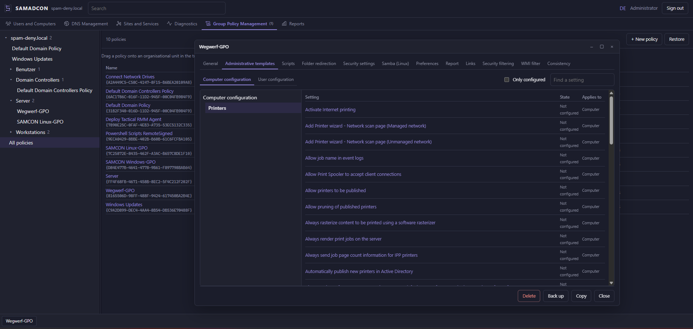
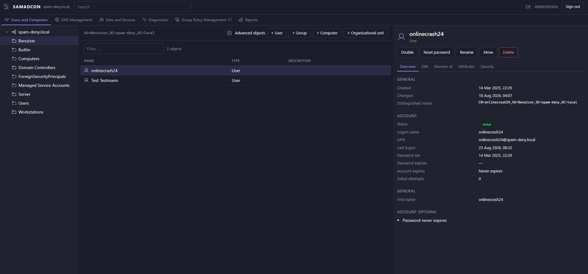
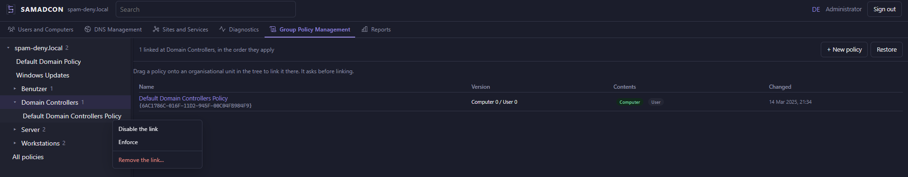
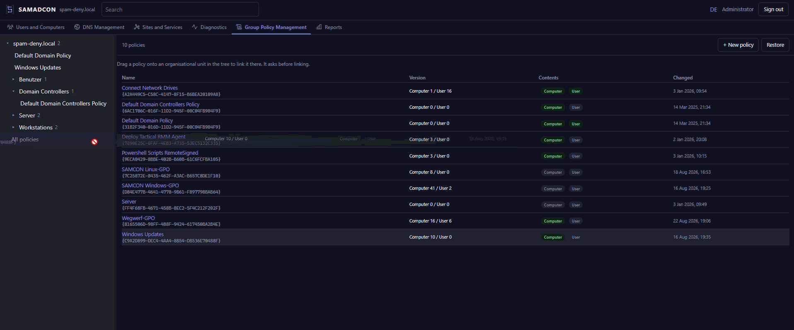

<p align="center">
  
</p>

<p align="center"><em><a href="README.md">English version</a></em></p>

Browserbasierte Verwaltungskonsole für Samba-AD-DC-Domänen. Ersetzt die Windows-RSAT-Werkzeuge
(ADUC, DNS-Manager, Sites & Services, GPMC) durch einen Docker-Container — **inklusive
Gruppenrichtlinien-Editor**, den vergleichbare Projekte auslassen.

SAMADCON spricht ausschließlich Standardprotokolle: **LDAPS, Kerberos und SMB**. Der Container
muss nicht auf einem Domänencontroller laufen und greift nie direkt auf dessen Dateisystem zu.

> Status: alle fünf Meilensteine sind gebaut und gegen eine echte Samba-AD-Domäne geprüft —
> siehe [Meilensteine](#meilensteine). Veröffentlicht als 0.5.x: heute benutzbar, die
> Oberfläche ändert sich zwischen Versionen aber noch. Was sich je Release geändert hat,
> steht im [Changelog](CHANGELOG.md).

<p align="center">
  <a href="docs/screenshots/SAMADCON_GPO_Editor.png">
    
  </a>
</p>

## Warum

RSAT setzt einen domänengejointen Windows-Client voraus. In reinen Linux-Umgebungen fällt es damit
komplett aus, und `samba-tool` deckt als CLI-Werkzeug nur einen Teil des Tagesgeschäfts ab.

## Wie es aussieht

Das Fenster oben ist der Teil, den vergleichbare Projekte auslassen: administrative Vorlagen,
Sicherheitseinstellungen, der Samba-/VGP-Baum, Einstellungen, Skripte und Ordnerumleitung —
jeweils ein Reiter derselben Richtlinie. Das Fenster steht über der Konsole und hat eine eigene
Taskleiste, so wie ein MMC-Snap-in.

<p align="center">
  <a href="docs/screenshots/SAMADCON_Users_and_Computers.png">
    
  </a>
</p>

**Benutzer und Computer** — Baum, Objektliste und die Eigenschaften des Ausgewählten: die
Anordnung, die ADUC verwendet. Jede Konsole ist ein eigener Reiter, weil in RSAT jede davon ein
eigenes Programm ist und kein Ast eines gemeinsamen Baums.

<p align="center">
  <a href="docs/screenshots/SAMADCON_right_click.png">
    
  </a>
</p>

**Gruppenrichtlinienverwaltung** — der Baum zeigt, welche Richtlinie wo greift, und das Menü
der Verknüpfung setzt ihre beiden Schalter und entfernt sie. Die rechte Maustaste wirkt an den
Objekten selbst, nicht nur an einer Leiste irgendwo darüber.

<p align="center">
  
</p>

**Verknüpfen durch Ziehen** — eine Richtlinie auf eine Organisationseinheit fallen lassen, und
sie fragt, bevor sie verknüpft. Eine Richtlinie kann an beliebig vielen Einheiten hängen.

Die Aufnahmen zeigen eine laufende Samba-AD-Domäne, keinen Entwurf.

## Sicherheitsmodell

Jeder Administrator meldet sich mit seinem **eigenen AD-Konto** an. SAMADCON holt pro Sitzung ein
Kerberos-TGT in einen sitzungseigenen Credential-Cache auf tmpfs und führt **alle** LDAP- und
SMB-Operationen mit den Rechten dieses Kontos aus:

- Das Tool selbst braucht **kein** privilegiertes Dienstkonto.
- AD-Delegation, Sicherheitsfilterung und serverseitiges Auditing bleiben wirksam.
- Das Passwort wird nur zur Ticket-Beschaffung verwendet, **nie gespeichert und nie geloggt**.
- Jede schreibende Operation landet zusätzlich im lokalen Audit-Log (wer, was, DN, Attribut-Diff).

**Konten, mit denen die Domäne verwaltet wird, verschwinden nicht mit einem Klick.** Den
eingebauten Administrator zu deaktivieren oder zu löschen — erkannt an RID 500, ein Umbenennen
ändert also nichts —, oder ein Mitglied von Domain Admins, Schema Admins, Enterprise Admins oder der eingebauten
Administrators, verschachtelte Gruppen eingeschlossen, fragt vorher nach, mit einem Haken, ohne den der Knopf
nichts tut. Durchgesetzt wird das vom Server, nicht von der Seite: ohne Bestätigung lehnt er ab,
egal auf welchem der drei Wege die Anfrage kam — Kontextmenü, Befehle im Detailbereich oder
Eigenschaftenblatt —, und das Audit-Log vermerkt, dass bestätigt wurde. Den eingebauten
Administrator selbst kann man gar nicht löschen: Samba legt ihn als kritisches Systemobjekt an,
wie auch Gast und krbtgt.

## Mehrere Domänen

Die Domäne wird **bei der Anmeldung** gewählt, nicht beim Start des Containers. In der
Anmeldemaske stehen zur Auswahl:

- **Freie Eingabe** einer IP-Adresse oder eines Hostnamens,
- **vorkonfigurierte Domänen** aus `SAMADCON_SERVERS_FILE` (siehe
  [servers.example.json](docker/servers/servers.example.json)),
- die im Container hinterlegte **Standarddomäne**, falls konfiguriert.

**Der ausgelieferte Stack schaltet die freie Eingabe ab.** Er schreibt
`SAMADCON_ALLOW_CUSTOM_SERVERS: "0"` in die Compose-Datei selbst, weil eine Instanz je Domäne
die Aufteilung ist, für die er geschrieben ist: die Anmeldemaske zeigt dann die eingetragene
Domäne und sonst nichts, und das Backend weist eine getippte Adresse ebenfalls ab. Es ist ein
fester Wert und kein `${VAR}`, geändert wird er also in der Datei — ein Umgebungsfeld in
Portainer erreicht ihn nicht.

**Mehrere Domänen aus einer Instanz gehen mit dieser Einstellung trotzdem.** Sie schließt das
freie Adressfeld, nicht die eingetragenen Domänen: sie in einer `servers.json` aufführen, deren
Verzeichnis einhängen und `SAMADCON_SERVERS_FILE` setzen — beide Zeilen stehen auskommentiert im
Stack, neben der Einstellung, zu der sie gehören. `SAMADCON_ALLOW_CUSTOM_SERVERS` nur dann auf
`1` setzen, wenn Administratoren beliebige Adressen eintippen können sollen; alles Folgende
beschreibt diesen Fall.

Bei Eingabe einer IP ermittelt SAMADCON die Domäne selbst: Ein anonymer rootDSE-Abruf liefert
Realm, den FQDN des Domänencontrollers und die Naming Contexts. Das ist nötig, weil Kerberos
Tickets auf `ldap/dc1.example.lan@EXAMPLE.LAN` ausstellt — aus einer nackten IP lässt sich weder
der SPN noch der Realm ableiten. Anschließend wird eine Kerberos-Konfiguration erzeugt, die genau
diese Adresse als KDC einträgt. Mehrere Realms werden parallel unterstützt.

**Damit gibt es das Ticket, aber noch keine Sitzung: der Container muss die Domäne trotzdem
auflösen.** Das Ticket lautet auf `ldap/<Name des DC>`, LDAP authentifiziert also gegen diesen
Namen; SYSVOL und damit der Richtlinien-Editor verbinden über diesen Namen; und Samba findet einen
Controller per Netlogon über die SRV-Einträge der Domäne. Mit nur einer Adresse endet die
Anmeldung in `dc_name_unknown`, mit dem Namen, aber ohne SRV-Einträge, in
`NT_STATUS_NO_LOGON_SERVERS`. Die Controller in `SAMADCON_DC_HOSTS` oder einem Profil zu benennen,
erspart die *Suche* nach einem DC, nicht das *Auflösen*. Eine frühere Fassung dieses Abschnitts
behauptete anderes; der Code hat das nie getan.

Der Resolver muss also die Zone der Domäne kennen:

- **Eine Domäne:** `dns:` auf ihren Domänencontroller.
- **Mehrere Domänen: ein Resolver, der alle kennt, nicht der DC einer davon.** Ein DC antwortet
  für seine eigene Zone und sagt für jede andere NXDOMAIN — und ein zweiter `dns:`-Eintrag hilft
  nicht, denn ein Resolver fragt den nächsten Server nur, wenn der erste nicht antwortet, nicht,
  wenn er sagt, dass es den Namen nicht gibt. Also dnsmasq, Unbound, AdGuard o. ä. mit einer
  Weiterleitung je Zone an den DC dieser Domäne, und `dns:` zeigt darauf; oder die `dns:`-Zeilen
  ganz streichen, wenn der Resolver des Docker-Hosts das schon kann. Mehr braucht eine Instanz
  nicht, um mehrere Domänen zu bedienen: ein Betreiber fährt drei so, als Profile aus einer
  `servers.json`, bei ausgeschalteter freier Eingabe.

### Transport

SAMADCON verbindet sich in zwei Stufen, beide verschlüsselt:

1. **LDAP (389) mit GSSAPI Sign&Seal** — der Kerberos-Sitzungsschlüssel verschlüsselt den Verkehr,
   ganz ohne Zertifikat. Das ist der Weg, den `samba-tool` und die Windows-Werkzeuge gehen, und der
   in Sambas Client-Stack am besten unterstützte.
2. **LDAPS (636)** als Rückfallebene, falls Port 389 gesperrt ist.

`seal` wird dabei *verlangt*, nicht erbeten: Ein Server, der es nicht kann, lässt die Verbindung
scheitern, statt still auf Klartext herunterzustufen.

Die Anmeldemaske meldet vorab, ob das LDAPS-Zertifikat überprüfbar ist. Bei einem selbstsignierten
Samba-Zertifikat kann die Prüfung **pro Sitzung** abgeschaltet werden — das betrifft aber nur
Stufe 2. Für den Normalfall ist weder ein Zertifikat noch eine CA-Datei nötig.

## Schnellstart

Jedes Release wird gebaut und in der GitHub Container Registry abgelegt. Es muss nichts
geklont und nichts gebaut werden:

```bash
docker pull ghcr.io/onlinecrash24/samadcon:latest
```

**Welcher Tag.**

| Tag | Was er ist |
|---|---|
| `latest` | Das neueste Release. Wandert mit jedem getaggten Release — das benutzen die Beispiele unten. |
| `0.5.18` | Ein Release, und es ändert sich nie. **Hier festnageln, wo ein Upgrade eine Entscheidung sein soll.** |
| `0.5` | Das neueste Release dieser Minor-Reihe. |
| `dev` | Die Spitze des DEV-Zweigs: woran gearbeitet wird, vor einem Release. |
| `sha-<kurz>` | Ein Commit. Jeder Build trägt einen. |

Nur ein Push auf `DEV` und ein Versions-Tag bauen ein Image; ein Push auf `main` baut nichts.
`latest` ist also das neueste *Release*, nicht der neueste Commit des Standardzweigs, und `dev`
ist der einzige Tag, der sich mit der täglichen Arbeit bewegt.

`latest` ist die richtige Vorgabe: es ist ein Release, es wurde getestet, und es veraltet nicht
so, wie eine in ein Dokument geschriebene Versionsnummer veraltet. Eine Version festnageln, wo
ein Upgrade eine Entscheidung sein soll und keine Nebenwirkung des Ziehens. `dev` nur nehmen,
um etwas noch nicht Veröffentlichtes auszuprobieren — und damit rechnen, dass es sich ändert.

Es folgen drei Wege. Der erste ist das Kürzeste, was funktioniert. Der zweite ist derselbe
Stack, mit den Einstellungen in einer `.env` — das ist die Datei, die dieses Repository
ausliefert. Der dritte baut das Image aus dem Quelltext.

### 1 · Der kürzeste Stack

Das hier in einen Portainer-Stack einfügen, oder als `docker-compose.yml` in ein leeres
Verzeichnis legen und `docker compose up -d` aufrufen. Drei Werte müssen geändert werden — der
Name, unter dem die Konsole erreicht wird, der Realm und der Domänencontroller — und auf dem
Host muss nichts vorbereitet werden:

```yaml
services:
  samadcon:
    image: ghcr.io/onlinecrash24/samadcon:latest
    container_name: samadcon
    restart: unless-stopped
    environment:
      # Der Name, den man eintippt. Er wird zu CN und SAN des selbstsignierten
      # Zertifikats, und das ist auch alles, was er tut.
      SAMADCON_PUBLIC_HOST: "samadcon.example.lan"
      # Der Kerberos-Realm, in Großbuchstaben.
      SAMADCON_REALM: "EXAMPLE.LAN"
      # Der Domänencontroller. Eine IP genügt: den Namen liest er aus der rootDSE.
      SAMADCON_DC_HOSTS: "192.168.1.1"
      # INFO benennt, was passiert; DEBUG ist zum Eingrenzen eines Problems.
      SAMADCON_LOG_LEVEL: "INFO"
      # Nur die Domäne oben; die Anmeldemaske verliert ihr freies
      # Adressfeld. 1 nur, wenn Administratoren beliebige Adressen eintippen sollen.
      SAMADCON_ALLOW_CUSTOM_SERVERS: "0"
    ports:
      # Jede Schnittstelle — das braucht ein Browser auf einer anderen Maschine.
      # "127.0.0.1:8443:8443", wenn ein Reverse Proxy auf diesem Host läuft.
      - "8443:8443"
    # Der Resolver muss die Domäne bedienen: Kerberos findet sein KDC und die
    # Konsole findet die weiteren Controller über SRV-Einträge — in nahezu jeder
    # Domäne ist das der Controller oben, und der Realm in Kleinbuchstaben.
    dns:
      - "192.168.1.1"
    dns_search:
      - "example.lan"
    volumes:
      # Ein eigenes Zertifikat kommt hier hinein; ohne eines wird beim ersten
      # Start ein selbstsigniertes erzeugt.
      - samadcon-tls:/etc/samadcon/tls
      # CA-Bundles zum Prüfen der LDAPS-Zertifikate der DCs. Optional: der
      # Hauptweg ist LDAP mit Kerberos-Verschlüsselung und braucht keines.
      - samadcon-ca:/etc/samadcon/ca
      - samadcon-cache:/var/cache/samadcon
      - samadcon-data:/var/lib/samadcon
      # Die Prüfspur soll den Container überleben.
      - samadcon-logs:/var/log/samadcon
    # Kerberos-Ticketcaches liegen in /dev/shm und erreichen nie eine Platte.
    shm_size: 64m
    tmpfs:
      # uid/gid sind nötig: ein tmpfs-Mount gehört sonst root.
      - /run/samadcon:mode=0700,uid=1000,gid=1000,size=8m
    # Nichts hier muss privilegierter werden, als es startet.
    security_opt:
      - no-new-privileges:true
    # nginx lauscht auf 8443, oberhalb des privilegierten Bereichs.
    cap_drop:
      - ALL

volumes:
  samadcon-tls:
  samadcon-ca:
  samadcon-cache:
  samadcon-data:
  samadcon-logs:
```

Die Konsole steht dann auf `https://<host>:8443`, beim ersten Start mit einem selbstsignierten
Zertifikat.

Zwei Dinge in dem Block sollte man wissen, statt sie nur zu kopieren:

- **Benannte Volumes, keine Bind Mounts.** Ein in Portainers Web-Editor eingefügter Stack hat
  kein eigenes Verzeichnis auf dem Host: einen relativen Pfad wie `./tls` löst der
  Docker-Daemon auf, nicht Portainer, und Docker legt Fehlendes als Verzeichnis an, das root
  gehört. Der Container läuft als uid 1000 und könnte sein Zertifikat dort nicht schreiben. Das
  Image legt `/etc/samadcon/tls`, `/etc/samadcon/ca` und `/etc/samadcon/servers` an und gibt sie
  uid 1000, und Docker befüllt ein benanntes Volume aus dem Image-Verzeichnis samt dieser
  Eigentümerschaft — das Zertifikat landet also, wo es hingehört. Wer Dateien doch auf dem Host
  halten will, nimmt einen **absoluten** Pfad: `/srv/samadcon/tls:/etc/samadcon/tls`. Das
  funktioniert im Stack; ein relativer nicht.
- **`container_name` ist ein Name, den Sie wählen.** Ohne ihn benennt Portainer den Container
  nach Stack und Dienst. Mit ihm kann ein zweiter Stack desselben Images nicht starten, und ein
  Umbenennen des Stacks in Portainer erreicht den Container nicht. Eine Installation pro Host
  ist der Normalfall, und dort ist der feste Name das Nützlichere von beidem.

Lässt sich der Host auf keinen Resolver zeigen, der die Domäne bedient, kann ein einzelner Name
von Hand festgenagelt werden:

```yaml
    extra_hosts:
      - "smb-ad.example.lan:192.168.1.1"
```

Das ist die letzte Möglichkeit, kein Ersatz für `dns:`. Der Eintrag löst genau diesen einen
Namen auf und trägt keine SRV-Einträge, das KDC und die weiteren Domänencontroller werden also
weiterhin über einen Resolver gefunden — oder gar nicht.

### 2 · Derselbe Stack, mit den Einstellungen in einer `.env`

Das ist [`docker-compose.yml`](docker-compose.yml), wie das Repository sie ausliefert: der Stack
von oben, bei dem jeder Wert durch seinen Namen ersetzt ist. Stack und Einstellungen sind dann
zwei Dateien — eine, die von hier kommt und beim Update ersetzt wird, und eine, die Ihrer
Domäne gehört und nicht ersetzt wird.

```yaml
services:
  samadcon:
    image: ghcr.io/onlinecrash24/samadcon:latest
    restart: unless-stopped
    container_name: samadcon
    environment:
      SAMADCON_PUBLIC_HOST: "${SAMADCON_PUBLIC_HOST}"
      # Nur für eine Installation, die auch Port 8080 veröffentlicht — dort liegt
      # die Weiterleitung von HTTP auf HTTPS. Wird nur 8443 veröffentlicht, liest
      # das hier niemand.
#      SAMADCON_PUBLIC_HTTPS_PORT: "${SAMADCON_PUBLIC_HTTPS_PORT:-8443}"
      SAMADCON_REALM: "${SAMADCON_REALM}"
      SAMADCON_DC_HOSTS: "${SAMADCON_DC_HOSTS}"
      SAMADCON_LOG_LEVEL: "${SAMADCON_LOG_LEVEL}"
      # Only the domain configured above. The sign-in form then shows that one
      # and nothing else. One instance per domain is the arrangement this stack
      # is written for, so it is a fixed value rather than a variable: set it
      # to 1 here, in the file, for an instance meant to reach several. A
      # Portainer environment field cannot reach it — those feed ${VAR} only.
      SAMADCON_ALLOW_CUSTOM_SERVERS: "0"
      # Nur hinter einem Reverse Proxy, und dann dessen Host-Adresse. Nie 0.0.0.0/0.
      SAMADCON_TRUSTED_PROXIES: "${SAMADCON_TRUSTED_PROXIES}"
    ports:
      # SAMADCON_BIND ungesetzt: jede Schnittstelle. 127.0.0.1 hinter einem Proxy auf diesem Host.
      - "${SAMADCON_BIND:+${SAMADCON_BIND}:}${SAMADCON_HTTPS_PORT}:8443"
    dns:
      - "${SAMADCON_DNS}"
    dns_search:
      - "${SAMADCON_DNS_SEARCH}"
    volumes:
      - samadcon-tls:/etc/samadcon/tls
      - samadcon-ca:/etc/samadcon/ca
      - samadcon-cache:/var/cache/samadcon
      - samadcon-data:/var/lib/samadcon
      - samadcon-logs:/var/log/samadcon
    shm_size: 64m
    tmpfs:
      - /run/samadcon:mode=0700,uid=1000,gid=1000,size=8m
    security_opt:
      - no-new-privileges:true
    cap_drop:
      - ALL

volumes:
  samadcon-tls:
  samadcon-ca:
  samadcon-cache:
  samadcon-data:
  samadcon-logs:
```

Auf einem Host mit `docker compose` stehen die Einstellungen in einer `.env` daneben:

```bash
cp .env.example .env
$EDITOR .env
docker compose up -d
```

**In Portainer gibt es keine `.env`-Datei.** Dieselben Namen in die Umgebungsfelder des Stacks
eintragen, oder eine Datei über *Load variables from .env file* hochladen. Die Compose-Datei
bleibt in beiden Fällen unangetastet — und genau darum ist sie so geschrieben.

Die Namen stehen in [`.env.example`](.env.example), und `scripts/check_versions.py` prüft, dass
beide Dateien dieselben aufführen: eine im Stack ergänzte und im Beispiel vergessene Variable
ist eine Einstellung, von der niemand weiß, dass es sie gibt — und eine, die im Beispiel
stehen blieb, nachdem der Stack sie nicht mehr liest, ist eine Einstellung, die nichts tut. Das
ist schlimmer, denn irgendwer wird sie setzen und daran glauben.

**Keiner der Werte ist hier optional**, bis auf einen: `SAMADCON_BIND` ist zum Weglassen gedacht,
und ungesetzt bindet er jede Schnittstelle. Für den Rest gilt: ein nicht gesetzter Name wird zur
leeren Zeichenkette, nicht zu einer Vorgabe: ein leeres `dns:` lässt den Container ohne Namensauflösung, und ein
leerer Port macht aus `"${SAMADCON_HTTPS_PORT}:8443"` ein `":8443"` — und das liest Docker als
*irgendein freier Host-Port*. Das ist der Preis dafür, die Werte aus der Datei zu halten.
Beispiel 1 oben ist die Fassung für eine Installation, die lieber eine Datei und keinen zweiten
Schritt hat.

Das Kennwort des Domänenadministrators gehört in keine der beiden Dateien. Die Konsole nimmt
ohnehin keines aus der Umgebung; sie fragt den, der sich anmeldet, und handelt mit dessen
eigenem Konto.

### 3 · Aus dem Quelltext bauen

Dafür gibt es keine Compose-Datei. Das Image wird aus `docker/Dockerfile` gebaut, mit dem
Projektwurzelverzeichnis als Build-Kontext — das ist keine Nebensache, das Dockerfile kopiert
`backend/` und `frontend/` daraus:

```bash
git clone https://github.com/onlinecrash24/SAMADCON.git
cd SAMADCON
docker build -f docker/Dockerfile -t samadcon:local .
```

Dann starten. Das ist der Stack aus Beispiel 1 als `docker run`, mit zwei Unterschieden: er
bindet auf Loopback, weil ein laufender Umbau nichts ist, das man auf jeder Schnittstelle
veröffentlicht, und er veröffentlicht auch 8080 — das ist der Port, der von HTTP auf HTTPS
weiterleitet, und die einzige Stelle, an der `SAMADCON_PUBLIC_HTTPS_PORT` überhaupt gelesen
wird:

```bash
docker run -d --name samadcon --restart unless-stopped \
  -p 127.0.0.1:8443:8443 \
  -p 127.0.0.1:8080:8080 \
  --dns 192.168.1.1 --dns-search example.lan \
  -e SAMADCON_PUBLIC_HOST=samadcon.example.lan \
  -e SAMADCON_PUBLIC_HTTPS_PORT=8443 \
  -e SAMADCON_REALM=EXAMPLE.LAN \
  -e SAMADCON_DC_HOSTS=192.168.1.1 \
  -e SAMADCON_LOG_LEVEL=DEBUG \
  -v samadcon-tls:/etc/samadcon/tls \
  -v samadcon-ca:/etc/samadcon/ca \
  -v samadcon-cache:/var/cache/samadcon \
  -v samadcon-data:/var/lib/samadcon \
  -v samadcon-logs:/var/log/samadcon \
  --shm-size 64m \
  --tmpfs /run/samadcon:mode=0700,uid=1000,gid=1000,size=8m \
  --security-opt no-new-privileges:true \
  --cap-drop ALL \
  samadcon:local
```

Jedes `-e` darf entfallen: ohne eingetragene Domäne fragt die Anmeldemaske nach einer
Serveradresse und ermittelt den Rest selbst. [Was eingestellt werden muss](#was-eingestellt-werden-muss)
führt die übrigen auf.

Die Oberfläche läuft anschließend auf `https://localhost:8443`. Ohne gemountetes Zertifikat
erzeugt der Container beim ersten Start ein selbstsigniertes.

Neu bauen heißt: `docker build` erneut, dann `docker rm -f samadcon` und derselbe `docker run`.
Die benannten Volumes überleben das — der Audit-Verlauf liegt in `samadcon-logs`.

### Hinter einem Reverse Proxy

Die Stacks oben veröffentlichen auf jeder Schnittstelle, weil ein Proxy auf einer anderen
Maschine herankommen muss. Läuft der Proxy auf diesem Host, stattdessen auf Loopback binden —
`SAMADCON_BIND=127.0.0.1` in der `.env` oder in den Umgebungsfeldern des Stacks, oder
`127.0.0.1:8443:8443` im ersten Beispiel — dann erreicht die Konsole von außerhalb des Hosts
überhaupt niemand. `SAMADCON_BIND` kam in 0.5.2 mit Loopback als Vorgabe, fiel in 0.5.15 ohne
Ankündigung aus dem Stack und ist zurück: ungesetzt heißt jetzt jede Schnittstelle, und genau
das hat der Stack in der Zwischenzeit getan. (Ein von Hand gestarteter
Quelltext-Bau bindet auf Loopback — siehe [Aus dem Quelltext bauen](#3--aus-dem-quelltext-bauen)
—, weil das beim Arbeiten daran die sichere Vorgabe ist; der Stack mit dem fertigen Image
veröffentlicht auf allen Schnittstellen, weil ein Stack auf einer anderen Maschine genau das
braucht.)

**Ein Proxy auf einer anderen Maschine** braucht das Gegenteil von Loopback: SAMADCON muss auf
einer Adresse antworten, die der Proxy-Host erreicht. Alles Weitere folgt aus vier Einstellungen,
und jeder der üblichen Fehler ist eine davon, die auf das Falsche zeigt:

| Einstellung | Was sie sein muss | Falsch, wenn |
|---|---|---|
| `SAMADCON_BIND` (oder die Adresse in `-p`) | Eine Adresse, die der Proxy-Host erreicht — die LAN-Adresse dieses Hosts, oder gar keine, dann jede Schnittstelle | Auf `127.0.0.1` gelassen: der Proxy bekommt „connection refused“ |
| `SAMADCON_TRUSTED_PROXIES` | Die Adresse des Proxy-**Hosts**, nicht die seines Containers | Im Audit-Log steht weiterhin der Proxy |
| `SAMADCON_PUBLIC_HOST` | Der Name, den die Leute im Browser eintippen | Betrifft nur das selbstsignierte Zertifikat, das der Proxy nicht prüft |
| `SAMADCON_PUBLIC_HTTPS_PORT` | Der Port, den die Leute erreichen, also `443`, wenn der Proxy auf 443 lauscht | Betrifft nur die Weiterleitung auf 8080, an die hinter einem Proxy niemand kommt |

Im Proxy auf **Port 8443 über https** weiterleiten. Port 8080 liefert eine Weiterleitung und den
Health-Check und sonst nichts, und Anmeldedaten dorthin zu schicken hieße, sie im Klartext über
die Leitung zu geben. Das Zertifikat auf 8443 ist selbstsigniert, solange Sie kein eigenes
eingehängt haben; Proxys prüfen das Zertifikat der Gegenstelle standardmäßig nicht, und der
Nginx Proxy Manager tut es auch nicht.

Die Adresse des Proxys sollte man nachlesen statt sie zu raten. Ein Proxy, der selbst in Docker
läuft, erreicht SAMADCON unter der Adresse seines *Hosts* und nicht der des Containers, weil der
Host die Verbindung maskiert. Melden Sie sich einmal an und sehen Sie im Audit-Log auf
`client_ip`: Die Adresse, die dort steht, gehört in `SAMADCON_TRUSTED_PROXIES`. Eintragen, erneut
anmelden — dann muss dasselbe Feld die Adresse des Browsers zeigen.

Ein Proxy muss benannt werden, sonst verliert das Audit-Log das Einzige, wofür es da ist:

```yaml
SAMADCON_TRUSTED_PROXIES: "192.168.1.5"     # oder "10.0.0.0/8, 192.168.1.5"
```

nginx sieht nur die Maschine, die sich verbunden hat, und hinter einem Proxy ist das der Proxy.
Ohne diesen Eintrag steht in jedem Audit-Eintrag dessen Adresse, und zwei Administratoren, die
durch denselben Proxy arbeiten, werden ununterscheidbar — ausgerechnet in der Aufzeichnung, die
sie auseinanderhalten soll.

Es ist eine Liste und kein Schalter, weil `X-Forwarded-For` ein gewöhnlicher Header ist, den jeder
Client senden kann. Geglaubt wird nur einem hier genannten Hop; eine Adresse, die nicht auf der
Liste steht, gilt als der Aufrufer, was immer sie behauptet. Leer lassen, wo kein Proxy steht — ein
falscher Eintrag ist schlimmer als keiner, denn er erlaubt diesem Host, sich für jeden auszugeben.

> **Niemals `0.0.0.0/0`, und niemals `::/0`.** Das konfiguriert die Einstellung nicht großzügig,
> sondern schaltet sie ab: Jeder Host wird ein vertrauenswürdiger Hop, jeder Client darf sagen,
> wer er ist, und das Audit-Log füllt sich mit Adressen, die die Aufrufer sich selbst ausgesucht
> haben. Das ist schlimmer, als die Einstellung leer zu lassen — eine leere Liste schreibt den
> Proxy hinein, was lediglich nichtssagend ist, eine weit offene schreibt Erfundenes hinein, das
> sich wie eine Tatsache liest.

Die eigene Adresse des Proxys eintragen. Nicht das Netz, in dem er steht, „zur Sicherheit etwas
größer": Jeder Host in diesem Netz erbt damit das Recht, in Ihrer Audit-Spur jede beliebige
Identität zu behaupten.

## Deployment

### Was auf dem Zielsystem liegen muss

Nichts, wenn das fertige Image läuft: es bringt alles mit, und [Schnellstart](#schnellstart) ist
das ganze Verfahren. Was folgt, gilt für einen Bau aus dem Quelltext.

```
SAMADCON/
├── docker-compose.yml          für das fertige Image; für einen Quelltext-Bau nicht nötig
├── .dockerignore               hält node_modules und lokale Geheimnisse aus dem Image
├── docker/
│   ├── docker-compose.yml      dieselbe Datei noch einmal, bei den übrigen Docker-Dateien
│   ├── Dockerfile
│   ├── entrypoint.sh
│   ├── nginx.conf.template
│   └── supervisord.conf
├── backend/
│   ├── pyproject.toml
│   └── samadcon/
└── frontend/
    ├── package.json
    ├── package-lock.json
    ├── index.html
    ├── tsconfig.json
    ├── vite.config.ts
    ├── src/
    └── public/
```

`backend/tests/` wird nur gebraucht, wenn mit `--target test` gebaut wird.

Nicht mitkopieren: `frontend/node_modules`, `frontend/dist`, `backend/samadcon.egg-info`, jedes
`__pycache__`, `.venv`. Die `.dockerignore` fängt das ab und hält zugleich Zertifikate und eine
etwaige lokale `.env` aus dem Image — Konfiguration kommt zur Laufzeit, nie in eine Bildschicht.

### Was eingestellt werden muss

Jede Einstellung ist eine Umgebungsvariable, und jede hat eine Vorgabe, die funktioniert. Sie
erreichen den Container über den `environment:`-Block des Stacks, über eine `.env` oder über
`-e` bei `docker run` — in allen drei Fällen unter denselben Namen. Gesetzt werden muss nichts,
was hier nicht als etwas aufgeführt ist, das eine Installation entscheidet.

**Der eine Wert, den praktisch jede Installation ändert:**

| Einstellung | Vorgabe | Wofür |
|---|---|---|
| `SAMADCON_PUBLIC_HOST` | `samadcon.local` | Der Name, unter dem die Konsole erreichbar ist. Landet als CN und SAN im selbstsignierten Zertifikat, und mehr liest ihn nicht. |

**Die Domäne.** Beide dürfen leer bleiben: die Anmeldemaske fragt dann nach einer Serveradresse
und ermittelt die Domäne daraus.

| Einstellung | Vorgabe | Wofür |
|---|---|---|
| `SAMADCON_REALM` | leer | Der Kerberos-Realm, in Großbuchstaben. |
| `SAMADCON_DC_HOSTS` | leer | Die Controller, komma-getrennt. Eine IP genügt: Kerberos stellt Tickets für `ldap/<hostname>@REALM` aus und kennt kein Principal für eine nackte Adresse, deshalb wird eine eingetragene Adresse wie eine eingetippte geprüft und der Name des DC kommt aus seiner rootDSE. |
| `SAMADCON_WORKGROUP` | der Realm bis zum ersten Punkt | Der NetBIOS-Name, wo diese Ableitung falsch ist. |
| `SAMADCON_SERVERS_FILE` | keine | Eine JSON-Datei mit Domänen, die die Anmeldemaske anbietet; siehe `docker/servers/servers.example.json`. |
| `SAMADCON_ALLOW_CUSTOM_SERVERS` | `1`, im Stack oben `0` | `0` lässt nur die eingetragenen Domänen zu: die Anmeldemaske verliert „Anderer Server …" und ihr freies Adressfeld, und das Backend weist eine getippte Adresse ebenfalls ab. Profile aus `SAMADCON_SERVERS_FILE` werden weiter angeboten. Der Stack trägt den Wert fest ein, geändert wird er also in der Datei. Wer ihn doch aus der Umgebung setzt, setzt ihn nicht leer — er ist ein Bool, und ein leerer Wert verhindert den Start. |

**LDAP.**

| Einstellung | Vorgabe | Wofür |
|---|---|---|
| `SAMADCON_LDAP_TRANSPORTS` | `ldap,ldaps` | Welche Transporte versucht werden dürfen, in dieser Reihenfolge. Beide verschlüsseln — `ldap` mit dem Kerberos-Sitzungsschlüssel, sign-and-seal *gefordert* statt erbeten, `ldaps` mit TLS. Sich auf einen festzulegen ist eine Richtlinienentscheidung, keine Härtung, und nimmt den Rückfallweg. |
| `SAMADCON_LDAP_CA_FILE` | keine | Die CA, die die Zertifikate der DCs signiert hat, zum Prüfen von LDAPS. Ein Samba-DC hält seine eigene unter `/var/lib/samba/private/tls/ca.pem`. |
| `SAMADCON_LDAP_INSECURE` | `0` | Schaltet die Zertifikatsprüfung für jede Verbindung ab. Dem Haken pro Sitzung in der Anmeldemaske den Vorzug geben. |
| `SAMADCON_LDAP_TIMEOUT_SECONDS` | `30` | Wie lange ein einzelner LDAP-Aufruf dauern darf. |
| `SAMADCON_LDAP_PAGE_SIZE` | `500` | Objekte pro Seite. Die Konsole läuft jede Seite ab; das entscheidet nur, wie viele Runden das kostet. |

**Die Weboberfläche.**

| Einstellung | Vorgabe | Wofür |
|---|---|---|
| `SAMADCON_PUBLIC_HTTPS_PORT` | `443` | Der Port, auf den die Weiterleitung auf 8080 verweist. Wird **nur** gelesen, wenn Port 8080 veröffentlicht ist; eine Installation, die allein 8443 veröffentlicht, erreicht diesen Server-Block nie. |
| `SAMADCON_TRUSTED_PROXIES` | leer | Der Reverse Proxy vor dem Container, falls es einen gibt. Ohne ihn steht in jedem Audit-Eintrag der Proxy statt des Administrators — siehe [Hinter einem Reverse Proxy](#hinter-einem-reverse-proxy). |

**Sitzungen.**

| Einstellung | Vorgabe | Wofür |
|---|---|---|
| `SAMADCON_TICKET_LIFETIME` | `10h` | Wie lange ein Kerberos-Ticket gilt. |
| `SAMADCON_RENEW_LIFETIME` | `7d` | Wie lange es erneuert werden darf. |
| `SAMADCON_SESSION_IDLE_MINUTES` | `60` | Leerlauf, bevor eine Sitzung verfällt. |
| `SAMADCON_LOGIN_MAX_ATTEMPTS` | `5` | Fehlanmeldungen je Konto, bevor SAMADCON keine Versuche mehr an den DC weiterreicht — das ist es, was die Weboberfläche davon abhält, eine AD-Kontosperre auszulösen. |
| `SAMADCON_LOGIN_LOCKOUT_MINUTES` | `5` | Wie lange es dann wartet. |

**Protokollierung.**

| Einstellung | Vorgabe | Wofür |
|---|---|---|
| `SAMADCON_LOG_LEVEL` | `INFO` | `INFO` benennt, was passiert; `DEBUG` ist zum Eingrenzen eines Problems. |
| `SAMADCON_AUDIT_FILE` | `/var/log/samadcon/audit.jsonl` | Jede schreibende Operation landet hier: wer, was, DN, Attributdiff. |
| `SAMADCON_SAMBA_LOG_LEVEL` | `0` | Höher setzen für Samba-Protokollspuren. Laut — außerhalb einer Fehlersuche auf 0 lassen. |
| `SAMADCON_DEV_MODE` | `0` | Zusätzliche Diagnose und eine gesprächigere Fehlerausgabe. |

**Ein Kennwort ist nicht darunter.** In keiner dieser Tabellen gibt es eine Einstellung, die
eines annimmt. Die Konsole fragt den, der sich anmeldet, und handelt mit dessen eigenem Konto —
und genau das macht den Audit-Verlauf erst aufbewahrenswert.

### Die Uhr

Kerberos verwirft ein Ticket, dessen Zeitstempel mehr als etwa fünf Minuten abweicht — und das
ist der Fehler, der einem falschen Kennwort am ähnlichsten sieht. SAMADCON lässt einen damit
nicht raten: die Anmeldung bricht mit `clock_skew` ab und sagt, dass die Uhren auseinanderlaufen.

**Eine Zeitserver-Einstellung gibt es hier nicht, und im Image auch keinen NTP-Client.** Beides
mit Absicht. Ein Container hat keine eigene Uhr — er liest die des Hosts —, und `cap_drop: ALL`
nimmt ihm `CAP_SYS_TIME`, ein Container, der die Zeit stellen könnte, würde also die des *Hosts*
stellen. Von innen zu synchronisieren ist nichts, was sich zum Funktionieren bringen ließe.

Zu synchronisieren ist deshalb der Docker-Host. In einer AD-Domäne ist der PDC-Emulator die
maßgebliche Quelle, der ohnehin jedes Domänenmitglied folgt:

```bash
timedatectl show -p NTPSynchronized     # auf dem Docker-Host, nicht im Container
chronyc sources                         # oder: ntpq -p
```

Die Toleranz selbst gehört der Domäne, nicht dem Container: *Kerberos-Richtlinie → Max. Toleranz
für die Synchronisation des Computertakts* (`MaxClockSkew`, in Minuten) — der Richtlinien-Editor
zeigt und ändert sie. Sie hochzusetzen ist nicht die Lösung: es vergrößert das Fenster, in dem
ein abgefangenes Ticket noch angenommen wird.

### Ablauf

Für das fertige Image ist [Schnellstart](#schnellstart) das Verfahren, dem nichts hinzuzufügen
ist. Aus dem Quelltext:

```bash
docker build -f docker/Dockerfile -t samadcon:local .
docker run -d --name samadcon --restart unless-stopped \
  -p 127.0.0.1:8443:8443 -p 127.0.0.1:8080:8080 \
  --dns 192.168.1.1 --dns-search example.lan \
  -e SAMADCON_PUBLIC_HOST=samadcon.example.lan \
  -e SAMADCON_REALM=EXAMPLE.LAN -e SAMADCON_DC_HOSTS=192.168.1.1 \
  -v samadcon-tls:/etc/samadcon/tls -v samadcon-ca:/etc/samadcon/ca \
  -v samadcon-cache:/var/cache/samadcon -v samadcon-data:/var/lib/samadcon \
  -v samadcon-logs:/var/log/samadcon \
  --shm-size 64m \
  --tmpfs /run/samadcon:mode=0700,uid=1000,gid=1000,size=8m \
  --security-opt no-new-privileges:true --cap-drop ALL \
  samadcon:local
```

Für ein echtes Zertifikat `server.crt` und `server.key` ins Volume `samadcon-tls` kopieren und
den Container neu starten. Ein benanntes Volume wird aus dem Image-Verzeichnis befüllt, das uid
1000 gehört — da ist nichts vorzubereiten. Der Fall, der schiefgeht, ist ein **Bind-Mount**: der
gehört root, der Container läuft als uid 1000, und ist das Verzeichnis nicht beschreibbar,
weicht der Entrypoint mit einer Warnung ins Volume `samadcon-data` aus — das Zertifikat liegt
dann nicht dort, wo man es sucht. Wer also doch eines einhängt:

```bash
mkdir -p docker/tls docker/ca && chown -R 1000:1000 docker/tls
```

Prüfen:

```bash
docker ps
```

Der Container hat einen Healthcheck auf `/api/v1/health` und meldet sich nach etwa zwanzig
Sekunden als `healthy`. Wenn nicht, sagt `docker logs samadcon` warum. Die Verbindung zum DC
lässt sich ohne Zugangsdaten prüfen:

```bash
docker exec samadcon samadconctl probe dc1.example.lan
```

Das fertige Image aktualisiert man mit `docker compose pull && docker compose up -d`; aus dem
Quelltext mit `docker build` erneut, dann `docker rm -f samadcon` und demselben `docker run`.
Die Volumes `samadcon-cache`, `samadcon-data` und `samadcon-logs` — dort liegt der Audit-Verlauf
— überleben beides.

## Test gegen einen vorhandenen Samba AD

Die Zugangsdaten kommen aus der Shell, nicht aus einer Datei — ein Domänenadministrator-Kennwort
hat in keiner Datei etwas verloren, die versehentlich mitgesichert werden kann.

Unit-Tests brauchen keine Domäne und laufen überall. Drei von ihnen vergleichen gegen Dateien, die
GPMC selbst erzeugt hat; sie liegen unter `backend/tests/data/` mit einer Notiz dazu,
[woher sie stammen](backend/tests/data/PROVENANCE.md) und was für die Veröffentlichung geändert
wurde.

Die Tests liegen im Image, nicht im Mount — dafür braucht es das Build-Ziel `test`. Einen
eigenen laufenden Server brauchen sie nicht, `TestClient` führt die Anwendung im selben Prozess
aus; es muss also nichts vorher ausgerollt werden, und der Container verschwindet wieder:

```bash
docker build -f docker/Dockerfile --target test -t samadcon:test .
docker run --rm \
  --dns 192.168.1.10 --dns-search example.lan \
  -e TEST_DC_HOST=dc1.example.lan \
  -e TEST_REALM=EXAMPLE.LAN \
  -e TEST_ADMIN_USER=Administrator \
  -e TEST_ADMIN_PASSWORD=... \
  -e TEST_INSECURE=1 \
  -e SAMADCON_COOKIE_SECURE=0 \
  samadcon:test python -m pytest tests/integration -q
```

Ohne `TEST_DC_HOST` und `TEST_ADMIN_PASSWORD` überspringen die Tests sich selbst.
`SAMADCON_COOKIE_SECURE=0` ist nicht optional: `TestClient` spricht http, ein `Secure`-Cookie
würde gesetzt und nie zurückgeschickt. Das Kennwort auf der Kommandozeile mitzugeben statt es in
eine Datei zu schreiben, ist der Sinn dieses Weges.

> Ein geänderter Test wird beim Bauen ins Image kopiert. Nach jeder Änderung an den Tests also
> erst neu bauen, dann das nächste `docker exec`.

> Die Tests legen Objekte an und löschen sie wieder — jeweils in einer eigenen OU
> `samadcon-test-<zufall>`. Nur gegen eine Testdomäne laufen lassen.

Wenn die Verbindung nicht zustande kommt, beantwortet das CLI im Container die Frage, woran es
liegt — ohne Zugangsdaten:

```bash
docker run --rm samadcon:test samadconctl probe 192.168.1.10
```

Und mit Anmeldung, bis zur rootDSE:

```bash
docker run --rm samadcon:test samadconctl check --server 192.168.1.10 --insecure
```

## Meilensteine

| # | Umfang | Status |
|---|---|---|
| 1 | Fundament, Auth, Benutzer/Gruppen/Computer/OUs (ADUC-Ersatz) | steht, gegen eine echte Domäne verifiziert |
| 2 | DNS, Sites & Services, Diagnose (FSMO, Replikation, Passwortrichtlinien) | steht, gegen eine echte Domäne verifiziert |
| 3 | GPMC-Basis: GPOs, Verknüpfungen, Filterung, Backup/Restore, Report | steht, gegen eine echte Domäne verifiziert |
| 4 | GPO-Editor: ADMX → Sicherheitseinstellungen → Linux/VGP → Preferences → Skripte/Ordnerumleitung | vollständig; jeder der fünf Teilbereiche auf einem echten Client als **angewendet** nachgewiesen (4c über `samba-gpupdate --rsop`), Preferences in allen drei Wellen. [Was von diesem Nachweis im Repository liegt](#der-richtlinien-editor) — und was nicht |
| 5 | Berichte: Befunde zur Domäne und ihren Richtlinien, und ein druckbarer Bericht | steht; die [Regeln](#berichte) laufen gegen eine echte Domäne, und jeder Befund trägt die Werte, aus denen er entschieden wurde |

Meilenstein 1 umfasst: Kerberos-Sitzungen, Baumnavigation, Objektlisten und Suche (ANR),
Benutzer (anlegen, bearbeiten, Kontooptionen, Passwort-Reset, Entsperren, Ablauf),
Gruppen (Bereich/Typ, Mitglieder inkl. verschachtelt und primär), Computer (inkl. LAPS-Lesen und
Konto-Reset), OUs (inkl. Löschschutz), Verschieben/Umbenennen/Löschen, Attribut-Editor,
ACL- und Delegationseditor, Audit-Log und die deutsche/englische Oberfläche.

Der DNS-Teil aus Meilenstein 2 arbeitet über LDAP statt über die DCE/RPC-Schnittstelle
(`samba-tool dns`): Zonen aus allen drei Partitionen — Domäne, Forest und der alten Ablage
unter `CN=System` —, Einträge der Typen A, AAAA, CNAME, NS, PTR, MX, SRV und TXT anlegen,
ändern und löschen, dazu Zonen anlegen und löschen. Ein Name ist in AD **ein** Objekt mit
allen seinen Einträgen in einem mehrwertigen Attribut; SAMADCON zeigt trotzdem eine Zeile je
Eintrag und findet den zu ändernden über seine bisherigen Werte wieder. Passt der Eintrag
nicht mehr, hat ihn jemand anders geändert — dann bricht die Änderung ab, statt zu raten.
Jede Änderung zieht die SOA-Seriennummer der Zone hoch und stempelt den geschriebenen
Eintrag damit, wie Samba es auf seinem eigenen Schreibweg tut; sonst erführe ein sekundärer
Nameserver nie, dass es etwas zu holen gibt.

**Standorte und Dienste** decken Standorte, Subnetze, Standortverknüpfungen und die Server
je Standort ab: anlegen, umbenennen, beschreiben, löschen, Subnetze einem Standort zuordnen
oder wieder lösen, Kosten und Replikationsintervall der Verknüpfungen, Domänencontroller
zwischen Standorten verschieben. Replikationsverbindungen werden nur angezeigt — die baut
der KCC selbst, und was man dort von Hand ändert, macht er beim nächsten Lauf rückgängig.
Standorte liegen in der Konfigurationspartition und gelten damit in der gesamten
Gesamtstruktur; das Löschen eines Standorts wird verweigert, solange noch ein DC oder ein
Subnetz darauf zeigt.

**Gruppenrichtlinien** sind der erste Teil, der nicht mehr allein über LDAP läuft: Eine GPO
besteht aus einem Verzeichnisobjekt und einem Verzeichnisbaum auf der SYSVOL-Freigabe, und
nichts erzwingt, dass die beiden übereinstimmen. SAMADCON legt sie in der Reihenfolge an, die
`samba-tool gpo create` verwendet — Objekt, Dateien, dann die aus dem Objekt abgeleiteten
SYSVOL-Rechte — und rollt bei einem Fehler die früheren Schritte zurück. Dazu Verknüpfungen
mit Reihenfolge, Erzwingung und Vererbungssperre, die Sicherheitsfilterung, und ein
Konsistenzbericht, den GPMC nicht kennt: Weicht die Version in `GPT.INI` von `versionNumber`
ab, lesen Clients die Richtlinie entweder nie neu oder bei jeder Anmeldung — und nichts sonst
sagt es einem.

Anlegen, Kopieren, Sichern, Wiederherstellen und Löschen stehen in der Oberfläche. Das Löschen
fragt nach und wird abgelehnt, solange noch Verknüpfungen auf die Richtlinie zeigen — die liegen
auf den Containern und müssen dort entfernt werden, was jede Konsole so hält.

Ist der Container mit `SAMADCON_DC_HOSTS` auf eine **IP-Adresse** gesetzt, fragt SAMADCON den DC
vor der Anmeldung nach seinem eigenen Namen und verbindet sich vorrangig darüber. Das ist keine
Kosmetik: Kerberos stellt Tickets für `ldap/<Hostname>@REALM` aus, und für eine nackte Adresse
gibt es keinen solchen Prinzipal. Ohne diesen Schritt scheitert die Anmeldung erst beim Bind,
mit `NT_STATUS_INVALID_PARAMETER` und ohne jeden Hinweis auf den Namen.

### Der Richtlinien-Editor

**Administrative Vorlagen** (4a) liest SAMADCON aus dem Central Store auf SYSVOL —
`.admx` samt sprachpassender `.adml`, einmal je Domäne geparst und gecacht — und erzeugt daraus
die Eingabemasken. Beim Schreiben übernimmt Sambas `RegistryGroupPolicies` die `Registry.pol`,
die `GPT.INI` und `versionNumber`; SAMADCON steuert zwei Dinge bei, die es nicht tut: die
Registrierung der Client-Erweiterung in `gPCMachineExtensionNames` und deren vorgeschriebene
Sortierung. Eine Richtlinie, deren Werte geschrieben, deren CSE aber nicht eingetragen ist,
wird von keinem Client gelesen — sichtbar in jeder Konsole, wirkungslos, ohne Fehlermeldung.

Nachgewiesen ist das nicht am geschriebenen Dateiinhalt, sondern am Client: `gpresult /h` auf
einem domänengejointen Windows 11 führt die Richtlinie unter *Applied GPOs* mit
*Extensions Configured: Registry* und *Revision: AD (9), SYSVOL (9)*, meldet die Registry-CSE
unter *Component Status* als **Success** und zeigt die Einstellung unter *Administrative
Templates* als **Enabled**. Formal korrekt geschriebene Dateien sind nicht dasselbe wie
angewandte Richtlinien — das ist der Unterschied, den nur dieser Test sieht.

**Was davon im Repository liegt und was nicht.** Die von GPMC erzeugten Referenzdateien liegen
darin: `backend/tests/data/` enthält `fdeploy1.ini`, `scripts.ini` und `GptTmpl.inf`, und die
Unit-Tests lesen sie, statt gegen eine Abschrift zu prüfen. Ihre Domänennamen, Hostnamen und SIDs
wurden vor der Veröffentlichung durch Beispielwerte ersetzt; das steht in
[`backend/tests/data/PROVENANCE.md`](backend/tests/data/PROVENANCE.md), zusammen mit dem Preis
dafür: Eine Byte-Zahl beweist nicht mehr, dass eine Datei die von GPMC geschriebene ist.

Die `gpresult`- und `samba-gpupdate --rsop`-Berichte liegen **nicht** hier. Einen davon zu
bereinigen ist erheblich aufwendiger als eine INI-Datei — ein `gpresult`-Bericht trägt den
gesamten angewandten Richtliniensatz einer echten Maschine. Diese Hälfte des Nachweises ruht also
auf ihrer Beschreibung, und wer sie aus erster Hand will, kann sie nachstellen: die Richtlinie in
SAMADCON anlegen, `gpresult /h` auf einem gejointen Client laufen lassen und vergleichen.

Zwei Formatdetails, gegengeprüft an einer von GPMC erzeugten Richtlinie statt aus der
Spezifikation abgeleitet: Ein „Aus", das ADMX als `<delete/>` ausdrückt, schreibt einen
**echten Eintrag** `**del.<Name>` (REG_SZ, ein Leerzeichen) — der Marker sagt dem Client, den
Wert wegzuwerfen, den er vielleicht schon hat. Und in `versionNumber` steht die
**Computerversion im niedrigen Halbwort**, die Benutzerversion im hohen.

Der Richtlinienbaum folgt der **Sprache der Oberfläche**: auf Deutsch liest SAMADCON die Texte
aus `de-DE`, auf Englisch aus `en-US`. Die Definitionen selbst enthalten keinen einzigen
sichtbaren Text — jeder Name im Baum kommt aus einem Sprachverzeichnis, weshalb das die ganze
Übersetzung ist. Fehlt das gewünschte Verzeichnis, nimmt der Server dieselbe Sprache aus einer
anderen Region, sonst Englisch — und **sagt es**: der Editor zeigt dann, welche Sprache
tatsächlich verwendet wurde und dass das passende Sprachpaket fehlt. Ein Baum ohne Beschriftung
wäre die schlechtere Antwort, ein stiller Rückfall die verwirrendere.

Wird eine Einstellung auf *Aktiviert* gestellt, füllt der Editor leere Eingaben mit den
Standardwerten aus der Vorlage — wie GPMC. Das ist keine Kosmetik: Wer `defaultValue` schreibt,
meint *diesen Wert*, und ein leeres Feld schreibt gar nichts. Sonst aktiviert man eine
Richtlinie, deren Optionen ungesetzt bleiben, und der Unterschied fällt erst auf, wenn ein
Client sich anders verhält als erwartet. Bereits gesetzte Werte bleiben unberührt.

**Vorlagen importieren.** Der Store hat einen eigenen Knoten im Gruppenrichtlinien-Baum,
**Administrative Vorlagen**, neben *Alle Richtlinien*: er gehört der Domäne, nicht einer einzelnen
Richtlinie, und die Seite zeigt, was installiert ist, in welchen Sprachen und wo auf SYSVOL. GPMC
hat nichts Vergleichbares — Windows-Administratoren kopieren den Ordner von Hand. *Vorlagen
importieren …* dort und in der Leiste des Editors jeder Richtlinie nimmt das Paket so, wie ein
Administrator es hat: das MSI von Microsoft, so wie es heruntergeladen wurde
(*Administrative Templates (.admx) for Windows 11 …*), ein ZIP des Ordners `PolicyDefinitions`,
oder diesen Ordner direkt ausgewählt. Alle drei landen in derselben Form — der Ordner mit den
`.admx`-Dateien wird die Wurzel des Stores, und aus `de-de` wird `de-DE`, wie Windows es schreibt.
Das MSI öffnet `msiextract` aus msitools, das im Image liegt; die Tabellen des MSI selbst benennen
die Dateien, sie kommen also unter ihren echten Namen heraus statt unter den internen Schlüsseln
des Cabinets.

Die Sprachen werden gewählt, vorausgewählt Deutsch und Englisch. Das Windows-11-Paket bringt 22
davon mit und 97 MB; zwei sind etwa 12, und SYSVOL wird auf jeden Domänencontroller repliziert.
Englisch lohnt sich über sich selbst hinaus: darauf fällt eine Vorlage zurück, der die
Übersetzung fehlt, und dem deutschen Satz fehlt eine (`SecureBoot.adml`). Vorlagen, die schon im
Store liegen, werden standardmäßig übersprungen oder auf Wunsch ersetzt — ein neueres
Windows-Release über ein älteres zu importieren ist genau der Fall dafür, und er war unmöglich,
solange die einzige Wahl war, alles abzulehnen.

Gemessen am Windows-11-Paket 25H2, v2.0: 5284 Dateien, 233 Vorlagen, 3628 Richtlinien, jede Datei
angenommen. Letzteres brauchte eine Korrektur. Microsoft schreibt `Search.admx` in UTF-16 und
deklariert es als `encoding='unicode'` — ein Name, den Windows liest und Pythons Codec-Verzeichnis
nicht kennt. Jeder Import des Pakets scheiterte an dieser einen Datei, und zwar mit einem
Serverfehler statt einer Meldung, weil die Ausnahme nicht der Parserfehler war, den die Prüfung
erwartete; und einem von einem Windows-DC herüberkopierten Store fehlten stillschweigend die 50
Richtlinien der Datei. Anerkannt wird nur genau diese Schreibweise, und nur mit der
Byte-Reihenfolge-Markierung, die sie eindeutig macht — beim Raten einer Kodierung entsteht Text,
den niemand geschrieben hat.

Importierte Vorlagen werden **vor** dem Schreiben geprüft, ein fehlerhaftes Paket landet also
gar nicht: Windows liest den Central Store als Ganzes und gibt bei einer einzigen unlesbaren Datei
**jede** administrative Vorlage der Domäne auf — der Gruppenrichtlinienbericht zeigt dann
domänenweit einen Parserfehler statt der Einstellungen. Geprüft wird deshalb, was diesen
Unterschied macht: wohlgeformtes XML, das richtige Wurzelelement, das oft vergessene
`<resources>`, bei einer `.admx` der eigene Namensraum und bei einer `.adml` die vom Schema
verlangte Kopfzeile `<displayName>` und `<description>` vor `<resources>`. Fehlt letztere,
meldet Windows *„Expected `<displayName>`, but found `<resources>`"* — ein Fehler, der auf das
Element zeigt, das da ist, statt auf das fehlende.

Ein Windows-Client, der den Central Store gelesen hat, hält die Vorlagen mit einem Lease offen,
das Schreiben verweigert — auch lange nach der Richtlinienaktualisierung. Ein Hochladen läuft
dann in `file_in_use`, und der sonst greifende Umweg „löschen statt überschreiben" hilft nicht,
weil das Lease auch das Löschen verweigert. Sichtbar mit `smbstatus --locks` auf dem DC; das
Lease löst sich von selbst, `smbcontrol smbd close-share sysvol` oder ein Neustart von
`samba-ad-dc` beendet es sofort. Dass vorher geprüft wird, kann nicht verhindern, dass ein
Lease einen Import mittendrin abbricht; die Fehlermeldung nennt dann, was schon geschrieben
war.

**Sicherheitseinstellungen** (4b) liegen in `GptTmpl.inf`, einer INI in UTF-16LE mit BOM:
Kennwort- und Kontosperrrichtlinie, Kerberos-Richtlinie, die Überwachungskategorien, das
Zuweisen von Benutzerrechten und eingeschränkte Gruppen. Drei Details stammen aus einer von GPMC
geschriebenen Datei statt aus einer Überlegung, und jedes widerspricht einem der *anderen*
Richtlinienformate dieses Projekts — was das ganze Argument dafür ist, erst eine echte Datei zu
lesen. Es gibt keine Präambel, wo `scripts.ini` mit einer Leerzeile beginnt. Leere Abschnitte
werden ausgeschrieben, wo `scripts.ini` sie weglässt. Und um das Gleichheitszeichen stehen
Leerzeichen — überall außer in `[Unicode]` und `[Version]`.

**Sambas eigene Richtlinien** (4c) sind die, die `samba-gpupdate` auf Linux-Domänenmitgliedern
anwendet: sudo-Rechte, symbolische Links, motd und issue, OpenSSH-Einstellungen und
PAM-Zugriffssteuerung. Windows-Clients ignorieren sie vollständig, der Nachweis läuft deshalb über
`samba-gpupdate --rsop` auf einem Mitglied statt über einen `gpresult`-Bericht. Eine
Client-Erweiterung wird für sie bewusst **nicht** registriert: `samba-tool gpo manage` tut es auch
nicht, und `samba-gpupdate` führt ohnehin jede geladene Erweiterung gegen jede zutreffende
Richtlinie aus.

**Preferences** (4d) decken zehn Typen in drei Wellen ab: Laufwerkzuordnungen,
Registrierungswerte, Dateien, Ordner, Verknüpfungen, Umgebungsvariablen, Drucker, lokale Benutzer
und Gruppen, Dienste und geplante Aufgaben. Jeder Typ hat eine **eigene** CSE-GUID, jeder wurde
deshalb einzeln als angewandt nachgewiesen — ein Nachweis trägt den anderen nicht. Zwei Dinge
haben die Referenzdateien schlicht widerlegt: Es gibt keine gemeinsame Tool-GUID für Preferences,
jeder Typ bringt seine eigene mit; und jeder Typ registriert **zwei** Gruppen, sein eigenes Paar
plus eines in einer gemeinsamen `{00000000-…}`-Gruppe, die Windows *Group Policy Infrastructure*
nennt.

Geplante Aufgaben werden gelesen, bearbeitet und entfernt, aber hier **nicht angelegt**. Eine
Aufgabe im V2-Format trägt einen ganzen Baum — Registrierungsinfo, Prinzipale, Trigger, Aktionen
und achtzehn Einstellungen —, und den ohne Beleg für jeden Teil aus dem Nichts zu schreiben, wäre
genau die Vermutung, die dieses Projekt nicht anstellt. Eine vorhandene Aufgabe bleibt vollständig
erhalten und bearbeitbar.

Die **Zielgruppenadressierung auf Elementebene** wird angezeigt und nicht angefasst. Sie bei jedem
Speichern mitzuschicken hieße, dass ein Umbenennen den Filter löschen kann, der bestimmt, für wen
ein Laufwerk verbunden wird — lautlos und in die freizügige Richtung. Ein gespeichertes Kennwort
(`cpassword`, verschlüsselt mit einem Schlüssel, den Microsoft 2014 veröffentlicht hat) wird
durchgereicht, wo es vorhanden ist, und kann von hier aus nie angelegt werden.

**Skripte** (4e) liegen in `scripts.ini` und `psscripts.ini` je Hälfte, **UTF-16LE
mit BOM und CRLF**. Als UTF-8 gespeichert liest der Client Buchstabensalat und führt nichts
aus — ohne Meldung. Innerhalb eines Abschnitts sind die Einträge nummerierte Paare, und die
Nummern *sind* die Ausführungsreihenfolge: sie müssen lückenlos bei null beginnen, weil Windows
beim ersten fehlenden Index aufhört. Umsortieren, Löschen und Hinzufügen sind deshalb dieselbe
Operation — SAMADCON schreibt immer die ganze Liste eines Ereignisses.

Zwei Details stammen aus einer von GPMC erzeugten Datei statt aus der Spezifikation, und beide
sähen sonst in jedem Diff wie eine Änderung aus, die niemand vorgenommen hat: zwischen BOM und
erstem Abschnitt steht eine **Leerzeile**, und ein Ereignis ohne Skripte bekommt **gar keinen
Abschnitt**, nicht etwa einen leeren. Der Unit-Test dazu vergleicht unsere Ausgabe Byte für Byte
mit dieser Datei.

Wird das letzte Skript einer Hälfte entfernt, trägt SAMADCON die Client-Erweiterung wieder aus.
Bliebe sie stehen, holte jeder Client die Richtlinie bei jeder Aktualisierung und fände nichts
darin.

Die **Ordnerumleitung** (ebenfalls 4e) schreibt `User/Documents & Settings/fdeploy1.ini`, und
deren Format widerspricht jedem anderen hier: Die Datei beginnt mit einer Leerzeile, fünf
Leerzeichen und noch einer Leerzeile; der Versionsabschnitt heißt klein geschrieben `[version]`;
und ein leerer Wert wird als `Key =` ohne abschließendes Leerzeichen geschrieben. Jedes dieser
Details wurde von einer GPMC-Datei abgelesen, und jedes war im ersten Anlauf falsch.

**Windows versteckt seine Richtliniendateien.** `scripts.ini`, `fdeploy1.ini` und `fdeploy.ini`
tragen das DOS-Attribut `HIDDEN`, `fdeploy.ini` zusätzlich `READONLY`. Das hat zwei Folgen, die
beide nicht wie das aussehen, was sie sind:

Eine Verzeichnisauflistung muss **ausdrücklich nach versteckten und System-Einträgen fragen** —
sonst fehlen genau diese Dateien, ohne dass etwas fehlschlägt. Der Einstellungsreport zeigte
dann eine Richtlinie als leerer, als sie ist. SAMADCON übergibt dieselbe Maske wie Sambas eigene
`ntacls`- und `gpo`-Werkzeuge.

Und `savefile()` öffnet zum Überschreiben mit normalen Attributen, was SMB bei einer versteckten
Datei **mit `ACCESS_DENIED` ablehnt** — eine Meldung, die zum Prüfen von ACLs verleitet, die
völlig in Ordnung sind. SAMADCON öffnet stattdessen mit `FILE_OVERWRITE_IF` und nennt dabei die
Attribute, die die Datei bereits hat; die Disposition kürzt selbst. Kein `truncate`: das ist in
den Python-Bindungen ein SMB1-Aufruf und scheitert gegen eine SMB3-Verbindung mit
`NT_STATUS_REVISION_MISMATCH`. Klappt auch das nicht, wird die Datei ersetzt — das kostet die
Attribute und steht als Warnung im Protokoll, denn ein Editor, der eine von GPMC angelegte
Richtlinie gar nicht bearbeiten kann, ist das schlechtere Ergebnis.

Gefunden wurde beides erst an einer echten, von GPMC erzeugten Richtlinie. Die Integrationstests
legen ihre GPOs selbst an, und deren Dateien haben normale Attribute — sie prüfen SAMADCON gegen
SAMADCON. Die Schreibpfade sind deshalb zusätzlich als Unit-Tests abgesichert, mit einer Attrappe
statt eines Domänencontrollers.

Die SMB-Verbindung braucht eine **s3-LoadParm** (`samba.samba3.param`), nicht die aus
`samba.param`, die SamDB nimmt. Mit der falschen antwortet `libsmb` mit
`NT_STATUS_INVALID_PARAMETER_MIX`, ohne den Parameter zu nennen. `samadconctl sysvol` prüft
diesen Pfad einzeln.

Die **Sicherung** ist ein ZIP mit dem SYSVOL-Baum und den beiden `.SAMBAEXT`-Dateien unter
Sambas eigenen Namen. Entpackt nimmt `samba-tool gpo restore` das Archiv an — gegengeprüft,
nicht angenommen. Eine leere `.SAMBAEXT`-Datei wird dabei nicht geschrieben: LDB lehnt ein
Attribut ohne Wert ab, und ein Archiv mit einer solchen Datei ließe sich mit `samba-tool`
überhaupt nicht einspielen.

Vom Editorbaum, den GPMC zeigt, bleiben vier Zweige bewusst draußen: *Software installation*,
*Name Resolution Policy*, *Deployed Printers* und *Policy-based QoS*. Sie kommen dazu, wenn sie
gebraucht werden. Eine kleine Abweichung innerhalb des Gebauten: den GPMC-Knoten
*Alle Einstellungen*, der alles flach auflistet, gibt es nicht; dorthin führt die Suche.

Der Einstellungsreport zeigt jede Richtlinie mit dem, was auf SYSVOL steht. Dass die
**Default Domain Policy einer Samba-Domäne dabei leer erscheint, ist richtig**: Samba legt sie
mit leeren Ordnern `MACHINE` und `USER` an und schreibt keine `GptTmpl.inf`. Die
Kennwortrichtlinie liegt am Domänenobjekt im Verzeichnis — dort liest sie die Diagnose, und
dort bearbeitet sie auch `samba-tool domain passwordsettings`. Bei einer aus Windows
gewachsenen Domäne steht in derselben Richtlinie dagegen eine Sicherheitsvorlage.

**Diagnose** ist durchgehend lesend: Domänencontroller mit Standort und GC-Kennzeichen, die
sieben Betriebsmasterrollen samt Inhaber, Funktionsebenen, der Replikationsstand des
verbundenen DCs aus `repsFrom`, die Kennwort- und Sperrrichtlinie einschließlich
differenzierter Richtlinien (PSOs) sowie gesperrte, deaktivierte und abgelaufene Konten.
Rollen zu übernehmen oder Replikation zu erzwingen gehört bewusst nicht dazu — dafür gibt es
`samba-tool fsmo seize` und `samba-tool drs replicate` auf dem DC.

### Berichte

Regeln über Werte, die SAMADCON selbst liest, in
`core/findings.py`. Jeder Befund trägt die Werte mit, aus denen er entschieden wurde, und lässt
sich damit bestreiten statt nur glauben: „Die Mindestlänge für Kennwörter ist 6, geprüft gegen 8"
ist nachprüfbar, „die Kennwortrichtlinie ist schwach" nicht.

**Hier läuft nichts von selbst, und es wird kein Sprachmodell befragt.** Die Konsole liest, wenn
man etwas öffnet, und schreibt, wenn man einen Knopf drückt — mehr ist es nicht. Es gab ein
optionales Modell, das die Befunde ausformulieren konnte; es war nur lesend und als ungeprüft
gekennzeichnet, und es ist weg — eine Konsole, die eine Domäne verwaltet, ist nicht der Ort dafür.
Automatismen und alles, was ein Modell befragt, gehören in eine eigene Anwendung mit eigener
Adresse und eigenem Konto.

Die Richtlinienregeln suchen nach dem Fehler, für den Gruppenrichtlinien berüchtigt sind und den
keine Konsole meldet: **Eine Richtlinie, die niemanden erreicht, sieht aus wie eine
funktionierende.** Ihre Einstellungen stehen da, ihre Versionen stehen da, ihre Verknüpfungen
stehen da — und es passiert nichts, weil keine clientseitige Erweiterung registriert ist, oder
jede Verknüpfung deaktiviert, oder die Hälfte mit den Einstellungen abgeschaltet.
`gpo_linked_but_empty` schlägt in echten Domänen an, nicht nur in konstruierten. Eine gründliche
Prüfung liest zusätzlich die Dateien jeder Richtlinie auf SYSVOL; das ist ein Schalter und nicht
die Vorgabe, weil es einen Zugriff je Richtlinie kostet.

Zwei Regeln fehlen **bewusst**, und Tests halten sie fern: erzwungener Kennwortablauf, den NIST
zurückgezogen hat, weil geplante Wechsel Menschen zu vorhersehbaren Varianten eines Kennworts
drängen; und das Auflisten gesperrter oder deaktivierter Konten, das die Diagnose ohnehin zeigt
und das die Befunde begraben würde, die eine Entscheidung brauchen.

**Beide Berichte lassen sich drucken.** Es liegt keine PDF-Bibliothek im Image — der Browser
schreibt bereits PDFs mit durchsuchbarem Text, und die Abhängigkeitsliste ist bewusst kurz. Das
Dokument trägt die Werte und nicht nur die Befunde, denn wer einen Ausdruck in der Hand hält, kann
nicht nachsehen. Das Druck-Stylesheet erzwingt Schwarz auf Weiß: Ein Leser im dunklen Modus würde
sonst hellgraue Schrift auf weißes Papier drucken.

## Aufbau

```
backend/samadcon/     FastAPI-Anwendung
  core/               Executor (ein Worker-Thread je Sitzung), Audit, Fehlerübersetzung, Ratelimit
  auth/               Kerberos-TGT, krb5.conf für mehrere Realms, Sessions, CSRF
  ad/                 LDAP-Zugriff: Verbindungsziele, Server-Probe, Verzeichnis, ACLs
  gpo/                GPC/SYSVOL, ADMX, Registry.pol, Security-INF, Preferences, VGP
  api/v1/             HTTP-Router
frontend/src/         React + TypeScript (MMC-artiges Layout)
frontend/public/      Favicon
frontend/src/assets/  Lockup und Bildmarke, je hell/dunkel, dazu einfarbig
docker/               Dockerfile, Entrypoint, nginx, supervisord
docs/brand/           Lockup, Marke und Favicon zur Verwendung anderswo; die Oberfläche hat eigene
```

Die Samba-Python-Bibliotheken sind blockierend und nicht threadsicher. Alle Samba-Aufrufe laufen
deshalb ausschließlich über `samadcon/core/executor.py` (Threadpool mit Sperre je Sitzung) — nie
direkt aus einem Router.

## Technische Grundlage

Der GPO-Teil stützt sich auf bestehende Samba-Bausteine statt auf Nachbauten:

- `samba.policies.RegistryGroupPolicies` — schreibt Registry.pol, hält GPT.INI und LDAP
  `versionNumber` synchron und registriert CSE-GUIDs.
- `samba.dcerpc.preg` + `ndr_pack`/`ndr_unpack` — PReg-Format für Sonderfälle.
- `samba.gp_parse.*` — Parser für GptTmpl.inf, scripts.ini, \*.pol.
- `samba.netcmd.gpo` — Referenz für GPO-Anlage inkl. `dsacl2fsacl()` (SYSVOL-ACLs).

## Entwicklung

Backend lokal (benötigt `python3-samba` aus der Distribution):

```bash
python3 -m venv --system-site-packages .venv && .venv/bin/pip install -e "backend[dev]"
```

Tests ohne DC — laufen auch ohne `python3-samba` und ohne Container:

```bash
.venv/bin/pytest backend/tests/unit -q
```

### Die Version anheben

Sie steht an **einer** Stelle: `backend/samadcon/__init__.py`. `pyproject.toml`
deklariert `dynamic = ["version"]` und liest das Attribut von dort, die beiden
können sich also nicht widersprechen. Alles, was irgendjemandem eine Version
nennt — `/api/v1/health`, der Anmeldebildschirm, `samadconctl --version`, die
OpenAPI-Beschreibung — liest sie durch dieses Modul.

`frontend/package.json` muss ebenfalls eine tragen, weil npm das Feld verlangt.
Zur Laufzeit liest sie niemand, und genau deshalb driftet sie ab — sie wird
darum geprüft statt erinnert:

```bash
python scripts/check_versions.py
```

Der Lint-Job führt das bei jedem Push aus und vergleicht bei einem Tag-Bau
zusätzlich gegen den Tag. Dieser letzte Teil fängt, was keine Ein-Quellen-Lösung
erreicht: einen Tag, der gesetzt wurde, ohne die Version überhaupt anzuheben.

Das gibt es, weil v0.5.2 sich als 0.5.1 meldete — drei Dateien trugen die Zahl,
ein Release hob zwei davon, und gefunden hat es ein Leser, nicht das Projekt.

Die Release-Notizen stehen im annotierten Tag, und `CHANGELOG.md` wird daraus
erzeugt statt daneben gepflegt:

```bash
python scripts/build_changelog.py
```

Nach dem Setzen des Tags ausführen und das Ergebnis mitcommitten. Das Skript
schreibt die Datei jedes Mal komplett neu, von Hand Eingetragenes geht also
verloren — genau so ist es gemeint. Eine Quelle, und das ist der Tag.

Der Changelog ist englisch, weil die Tag-Notizen es sind. Eine zweite, gepflegte
Übersetzung wäre in kurzer Zeit veraltet, und eine veraltete Release-Notiz ist
schlechter als eine fremdsprachige, die stimmt.

## Lizenz

AGPL-3.0-or-later.

Die Konsole nennt sie und verweist von sich aus hierher — oben rechts im angemeldeten Zustand
und unten auf der Anmeldekarte. Das ist keine Zierde: §13 verpflichtet jeden, der SAMADCON
ändert und über ein Netz anbietet, den Nutzern den Quelltext anzubieten, und eine Konsole, die
nie sagt, woher sie kommt, macht das unmöglich. Wer sie abspaltet, richtet den Verweis bitte
auf die eigene Abspaltung, statt ihn zu entfernen.

Die Samba-Python-Bindungen, auf denen das aufsetzt (`samba.samdb`, `samba.dcerpc`, `samba.ndr`
und die übrigen), stehen unter GPL-3.0-or-later, `ldb` unter LGPL-3.0-or-later. AGPLv3 und
GPLv3 erlauben diese Kombination ausdrücklich, jeweils in ihrem eigenen §13.

Die Symbole sind Phosphor Icons, MIT, als Pfaddaten eingebettet statt als Dateien
geladen — siehe [THIRD-PARTY-NOTICES.md](THIRD-PARTY-NOTICES.md).
